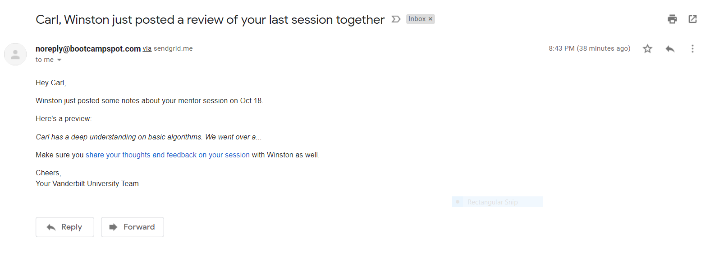
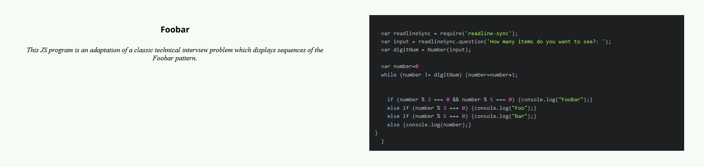
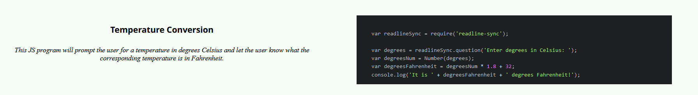
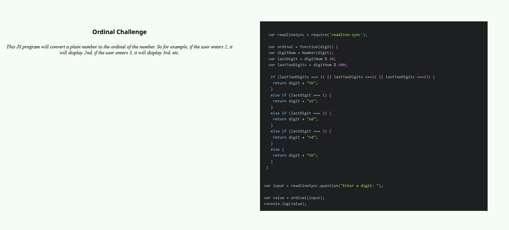

# Challenges

Most of these challenges are from CodeWars where they really hammer home on algorithm fundamentals. I can explain every line of code in each, and here is some feedback from my mentor in regards to my algorithm ability.

# Other Challenges

Challenges completed by Carl Hofstrom 

